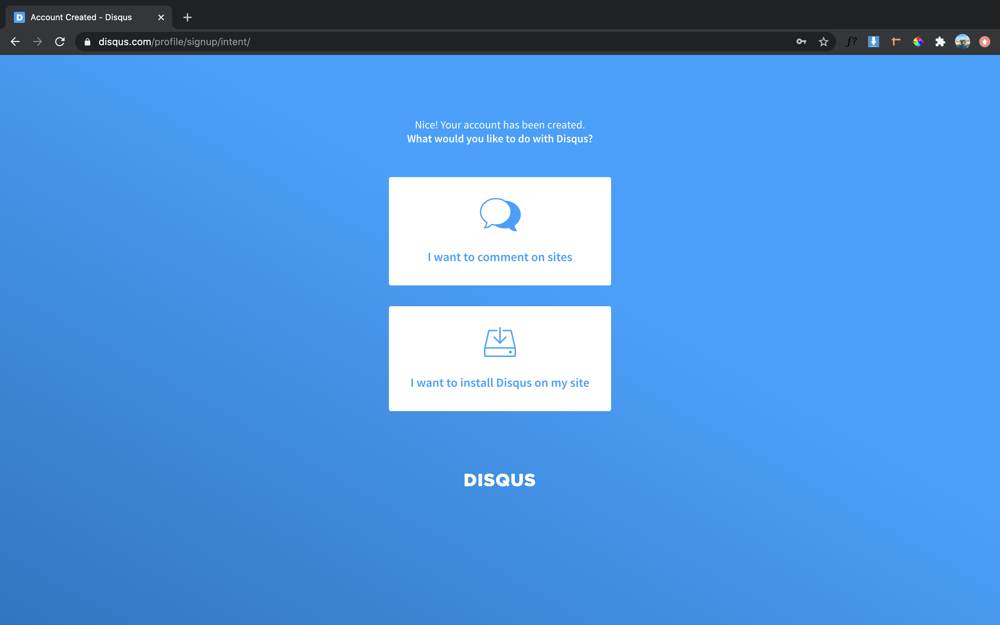
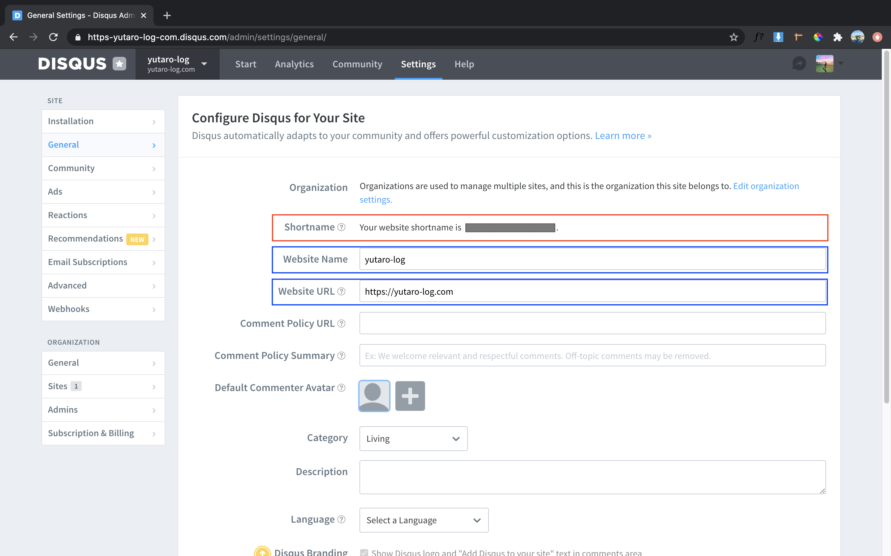
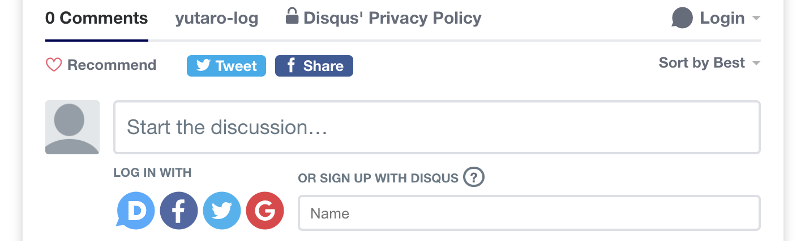

This blog is built with Gatsby. I have added a nice comment box by using third party comment plugin called "Disqus".

## What is Disqus ?
Here is the great overview from Disqus [official site](https://disqus.com/).
>Disqus offers an online public comment sharing platform where users login and create profiles to participate in conversations with peers and enjoy an interactive experience. 

It is also recommended in [Gatsby official docs](https://www.gatsbyjs.com/docs/adding-comments/)


<br></br> 

## Step by step guide

### 1. Sign up to Disqus 

You can register via [official site](https://disqus.com/).

Click "I want to install Disqus on my site" column for this time.




<br></br>Next, you need to fill up in detail of your site.

Please take note that the "Shortname" column in the red frame will be needed later. Colums in Blue frames must be filled up, I personally think that other columns are not mandatory to do so.




### <br></br>3. Install Disqus

**(1) Install command is as follows**

Now, the time to install the package using npm or yarn command

```$ npm install disqus-react```


**<br></br>(2) Import disqus plug-in**

Then you need to reflect a comment box to the blog posts.
Add following codes in to ```blog-post.js```.

```js:blog-post.js
import { DiscussionEmbed } from "disqus-react"
```

**<br></br>(3) Setting of the comment box**

I added it at the bottom of the page.

```js:blog-post.js
//---
const disqusShortname = "Shortname of your site";
  const disqusConfig = {
    identifier: post.id,
    title: post.frontmatter.title,
  }
```

**<br></br>(4) Add a comment box**

I added it at the bottom of the page as usual.

```js:blog-post.js
//---
  </ul>
  <DiscussionEmbed shortname={disqusShortname} config={disqusConfig} />
</nav>
```

### <br></br>3. Done
Now you can find a comment box at the bottom of your page!



I have read through those 2 sites for the referenced : [this](https://www.frontendstumbles.com/add-comments-to-a-static-gatsby-blog-with-disqus/) and [this](https://mk.gg/posts/add-disqus-comments-to-gatsby-blog/).

I have stucked for a while because I firstly inputted ```"Shortname of your site"``` wrongly as I didn't tkae note the Shortname while setting up Disqus.


<br></br>That's all.

Leaving me a comment below if anything.