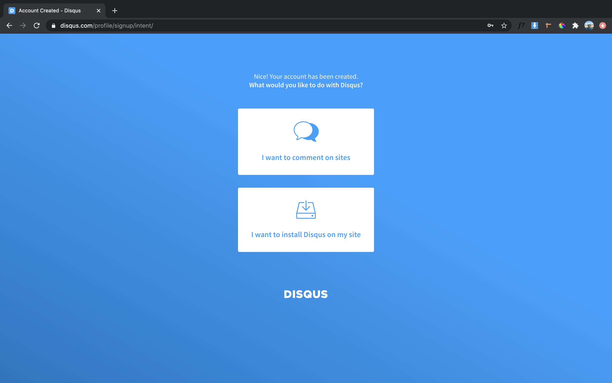
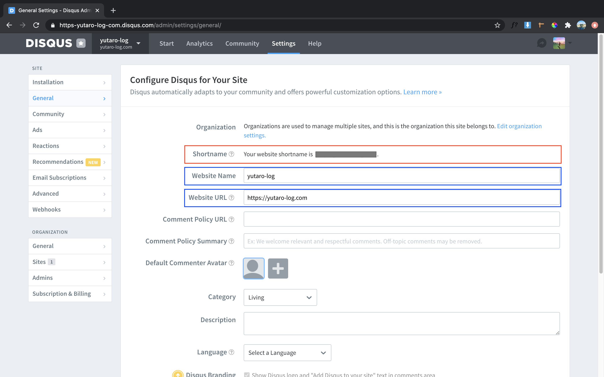
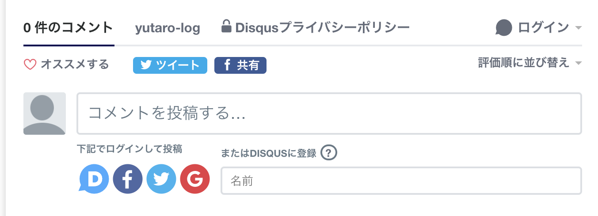

記事下部にDisqusを使用してコメント機能を追加した。

Disqusは基本無料で使えて、ブログにコメント機能をはじめSNSシェアボタンや広告を追加することでユーザー同士の交流を促進できるサービス。

Gatsbyの[公式ドキュメント](https://www.gatsbyjs.com/docs/adding-comments/)でもオススメされていた。


<br></br>以下簡単な手順。

詳しくは[これ](https://www.frontendstumbles.com/add-comments-to-a-static-gatsby-blog-with-disqus/)とか[これ](https://qiita.com/atomyah/items/5f602da57b0e756c5864)を参考に。

### <br></br>Disqus導入

[公式サイト](https://disqus.com/)から登録。

<br></br>登録が終わるとこんな画面。

"I want to install Disqus on my site" を選ぶ



<br></br>**サイト情報の入力**

青枠部分は必須、他はどっちでもいい気がする。

赤枠のShort-nameはあとで必要になるのでメモ。



### <br></br>Disqusインストールと設置

<br></br>**インストール**

```$ npm install disqus-react```


<br></br>**disqusプラグインのインポート**

```js:blog-post.js
import { DiscussionEmbed } from "disqus-react"
```

<br></br>**コメント欄の設定**

```js:blog-post.js
//---略---
const disqusShortname = "https-yutaro-log-com";
  const disqusConfig = {
    identifier: post.id,
    title: post.frontmatter.title,
  }
```

<br></br>**埋め込み**

普通にページの一番下に置いた。

```js:blog-post.js
//---<略>---
  </ul>
  <DiscussionEmbed shortname={disqusShortname} config={disqusConfig} />
</nav>
```

### <br></br>できた




珍しくあまり詰まることはなかったが、

最初```const disqusShortname ="  "```に参考サイトからコピペしたコードをそのまま入れてたらエラーが出てちょっと悩んだ。

というわけで他にも欲しい機能あったらコメントください。


<br></br>おわり